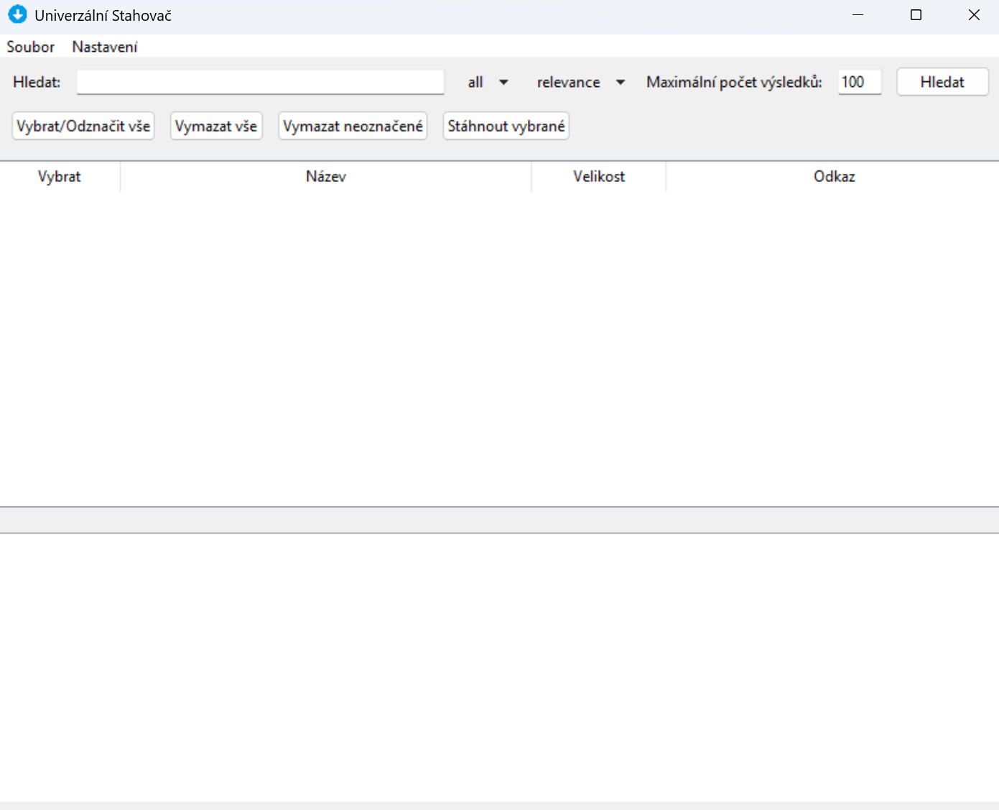
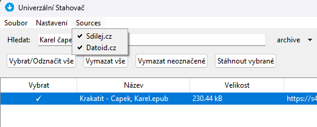

# Universal downloader

Lze použít pro stahování souborů z webů: 
- [datoid.cz](https://datoid.cz),
- [sdilej.cz](https://sdilej.cz),
- [prehraj.to](https://prehraj.to).

## Právní upozornění

> [!warning]
Tato aplikace je určena výhradně pro legální a autorizované použití. Není určena k obcházení autorských práv ani k získávání obsahu bez výslovného souhlasu držitelů práv. Uživatelé jsou plně zodpovědní za dodržování platných zákonů a podmínek použití webových stránek, ze kterých stahují obsah. Autor ani přispěvatelé nenesou odpovědnost za jakékoli škody nebo právní následky způsobené neoprávněným použitím této aplikace.

## Legal notice (English)

> [!warning]
This application is intended for lawful, authorized use only. It is not intended to circumvent copyright or to obtain content without the explicit permission of the rights holders. Users are solely responsible for complying with applicable laws and the terms of service of websites they access. The author and contributors are not liable for any damages or legal consequences resulting from improper use.

## Obsah
- [Universal downloader](#universal-downloader)
  - [Právní upozornění](#právní-upozornění)
  - [Legal notice (English)](#legal-notice-english)
  - [Obsah](#obsah)
  - [Instalace závislostí](#instalace-závislostí)
    - [Pod Linuxem](#pod-linuxem)
  - [Použití v příkazové řádce](#použití-v-příkazové-řádce)
    - [Help](#help)
    - [Vyhledání souborů](#vyhledání-souborů)
    - [Stažení souborů](#stažení-souborů)
  - [Použití v GUI](#použití-v-gui)
    - [Vyhlédání souborů](#vyhlédání-souborů)
    - [Načtení odkazů ze souboru](#načtení-odkazů-ze-souboru)
    - [Uložení odkazů do souboru](#uložení-odkazů-do-souboru)
    - [Stažení souborů](#stažení-souborů-1)
    - [Výběr zdrojů pro stahování](#výběr-zdrojů-pro-stahování)
  - [Pokročilé použití](#pokročilé-použití)
  - [Použití v TUI](#použití-v-tui)
  - [Vývoj](#vývoj)
    - [TODO:](#todo)
    - [Závislosti pro vývoj](#závislosti-pro-vývoj)
    - [Struktura projektu](#struktura-projektu)
    - [Jak sestavit exe soubor](#jak-sestavit-exe-soubor)
    - [Testování](#testování)
    - [Dokumentace](#dokumentace)

## Instalace závislostí
Závislosti jsou uvedeny v souboru `requirements.txt`. Pro jejich instalaci použijte následující příkaz:
```bash
pip install -r requirements.txt
```

### Pod Linuxem
Pro instalaci stačí spustit skript `install.sh`.

```bash
./install.sh
```

## Použití v příkazové řádce

### Help
```bash
python3 main.py --help
usage: main.py [-h] [-s SEARCH] [-t {all,video,audio,archive,images}] [-T {relevance,most_downloaded,newest,biggest,smallest}] [-d] [-f FILE] [-F FOLDER] [-n NUMBER]
               [-v] [-D] [-g] [-G] [-r]

Download files from internet.

options:
  -h, --help            show this help message and exit
  -s SEARCH, --search SEARCH
                        Search for files.
  -t {all,video,audio,archive,images}, --file-type {all,video,audio,archive,images}
                        Type of files to search for.
  -T {relevance,most_downloaded,newest,biggest,smallest}, --search-type {relevance,most_downloaded,newest,biggest,smallest}
                        Search format.
  -d, --download        Download the found files.
  -f FILE, --file FILE  File to download.
  -F FOLDER, --folder FOLDER
                        Folder to download to.
  -n NUMBER, --number NUMBER
                        Max number of files to search.
  -v, --verbose         Verbose mode.
  -D, --debug           Debug mode.
  -g, --tui             Start TUI.
  -G, --gui             Start GUI.
  -r, --remove          Remove downloaded files from the list.
```

### Vyhledání souborů
```bash
python3 main.py --search "název souboru" --file-type "audio" --search-type "smallest"
```
Vyhledané soubory se uloží do souboru `files.json`. 

> [!tip]
> Nyní je můžete manuálně projít a odstranit, které soubory nechcete stáhnout.

### Stažení souborů
```bash
python3 main.py --download
```
Tento příkaz projde obsah souboru `files.json` a stáhne všechny soubory, které jsou v něm uvedeny.

```bash
python3 main.py --download --remove
```
Projde soubory a pokud se poaří soubor stáhnout, tak i odstraní jeho záznam z `files.json`.

## Použití v GUI

```bash
python3 gui.py
```

Nebo:
```bash
python3 main.py --gui
```



Aplikace je přeložena do angličtiny a češtiny. Jazyk lze v nastavení aplikace volně měnit.

### Vyhlédání souborů

Do pole `Search` zadejte název souboru, který chcete stáhnout.
- Vyberte případně **typ** souboru, a **způsob** vyhledání.

Po stisknutí tlačítka `Search` se zobrazí seznam souborů, které odpovídají zadanému názvu.

### Načtení odkazů ze souboru

Pokud již máte uložené vyhledávání v soboru `files.json`, můžete je načíst pomocí tlačítka `Load`.

### Uložení odkazů do souboru

Po vyhledání souborů je možné je uložit do souboru `files.json` pomocí tlačítka `Save`. Pro pozdější použití.

> [!note] 
> Uloží se pouze soubory, které jsou označeny.

### Stažení souborů
Označte soubory, které chcete stáhnout a stiskněte tlačítko `Download`.

> [!tip]
> Když zaškrtnete tlačítko `Remove`, tak se soubor odstraní ze seznamu po úspěšném stažení.

### Výběr zdrojů pro stahování
V menu `Sources` je možné vybrat, ze kterých zdrojů se mají soubory vyhledávat a stahovat.



## Pokročilé použití
V grafickém režimu je možné vyhledat soubory ke stažení a následně je uložit do souboru `files.json`. Aplikaci pak můžte spustit v příkazové řádce a stáhnout soubory podle tohoto seznamu.

```bash
python3 main.py --download --remove
```

> [!note]
> Aplikace tak může běžet na serveru, kde nemáte grafické rozhraní.
> Stačí jen přesunout soubor `files.json` na server a spustit výše uvedený příkaz.

## Použití v TUI

```bash
python3 main.py --tui
```

> [!warning]
> PTG nefunguje pod OS Windows.

[TUI](TUI.md)

## Vývoj

### TODO:

- Integrace s dalšími weby:
  - [x] datoid.cz,
  - [x] sdilej.cz,
  - [x] prehraj.to

### Závislosti pro vývoj

- `msgfmt`

### Struktura projektu
```txt
├───assets
├───build
├───dist
├───docs
├───download
├───locales
│   ├───cs
│   └───en
├───src
│   ├───downloader
├───tests
```

Adresáře:
- `assets/` - ikony a obrázky používané v aplikaci.
- `build/` - dočasné soubory vytvořené při sestavování aplikace.
- `dist/` - výsledný `.exe` soubor po sestavení aplikace.
- `docs/` - vygenerovaná dokumentace projektu.
- `download/` - výchozí složka pro stahování souborů
- `locales/` - překladové soubory pro různé jazyky.
- `src/` - zdrojové kódy aplikace.
  - `downloader/` - moduly pro stahování z různých webů.
- `tests/` - testovací skripty pro ověření funkčnosti aplikace.

### Jak sestavit exe soubor
Pro sestavení exe souboru použijte:
- Windows: `build.bat`
- Linux: `build.sh`

Obsah skriptu `build.sh`:
```bash
#!/bin/bash

# Create a virtual environment
python -m venv venv

# Activate the virtual environment
source venv/bin/activate

# Upgrade pip
pip install --upgrade pip

# Install dependencies
pip install -r requirements.txt

# Build the application using pyinstaller
pyinstaller --onefile --windowed \
    --icon=assets/icon.ico \
    --add-data "assets/icon.png:assets" \
    --add-data "locales:locales" \
    --name universal_downloader \
    gui.py

# Deactivate the virtual environment
deactivate
echo "Done."
```

### Testování
Pro spuštění testů použijte:
```bash
pytest
```

Pro spuštění jednoho testu použijte například:
```bash
pytest tests/test_datoid_downloader.py
```

### Dokumentace
Pro vygenerování dokumentace použijte:
```cmd
pdoc .\gui.py .\main.py .\datoid_downloader.py -o ./docs
```

Linux:
```bash
pdoc ./gui.py ./main.py ./datoid_downloader.py ./sdilej_downloader.py ./prehrajto_downloader.py ./download_page_search.py -o ./docs
```

Je nastavená github actions pro automatické generování dokumentace při pushu do mainu a její nahrání na GitHub pages [zde](https://elpytel.github.io/Universal_downloader/).

